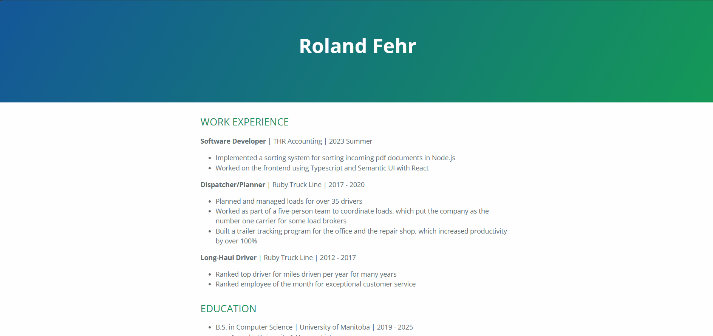

# How to host a Resume
The purpose of this readme is to create a simple pipeline for hosting a website. Anything could be hosted but we will host a resume. This project will use the modern approach as described by Andrew Etter in the book Modern Technical Writing. The primary idea is to make it easy for multiple people to contribute. Then whenever a change is committed, the website is automatically updated. To achieve this we use a lightweight markup language, format the document using a static site generator, and host the document on a distributed version control system. 

## Prerequisites

    A resume written in markdown

## Getting Started
### Resume
I created my resume in Markdown with very basic formatting. For the title and headings I used one or more hashtags and for the rest I used mostly lists. I'm continually surpised at how simple the document can be and yet so nice after applying a Jekyll theme. This document assumes you have a resume written in markdown. If you do not have one, I recommend creating a very simple resume with a few headers and a list or two to get started with this tutorial. 

### Distributed Version Control System
Using a distributed version control system is useful for many reasons, but a few important ones are: automatic backups, offline work, easier for multiple people to contribute, and for automatic updates to our website. We will use Github for our project because then we can use Github pages to host our resume. Github has made it very easy to upload documents and automatically update the website for that project. Etter stresses that when changes are made, the update process should be very simple. Because frequent changes and perhaps by multiple contributors should not be an issue.

1. [Click](https://github.com/login) to create Github Account

2. Create New Repository
    1. Click ```Create repository```
    2. Name the respository ```username.github.io``` This will ensure that the website will host automatically
    3. Click ```Create repository``` to save the changes

### Lightweight Markup Language
Now that the project is created it is time to upload the markdown resume. The reason we use markdown to create the resume is because markdown is flexible. It makes creating website content easy, it is human readable, it is platform independent, and is easy to use with static site generators. It also keeps content and style seperate. This way we can edit markdown on any platform with many free options for a markdown editor. 

3. Upload Resume
    1. Click ```uploading an existing file``` under the code section to upload your resume
    2. Rename the uploaded resume ```index.md``` so that github pages will use it for the website
    3. Add the following to the top of your resume

            ---
            title: Your Name
            ---
    4. Click ```Commit changes```

### Static Site Generator
Now that we have a markdown file, let's apply some style to it with Jekyll. It is a free and popular static site generator with many prebuilt themes available, and few are supported by default on github pages. Switching themes is as easy as changing one line of code and more importantly it is independent of the content. For my resume, I used the [Cayman](https://pages.github.com/themes/) theme, as can be seen by the following instructions. 

4. Create ```_config.yaml``` file
    1. Click ```Add file``` under the Code section
    2. Name the file ```_config.yaml```
    3. Add ```theme: jekyll-theme-cayman``` to the first line
    4. Click ```Commit changes```

This is what my resume looks like at this stage. 


### Site Complete
Congratulations! Your site should now be visible at ```username.github.io```. You might not see it immediately because it takes a minute or two to build. We have now created a complete pipeline to host a resume written in markdown and generated a static website with Jekyll. This is called a pipeline because you can now make a change to your resume or to the _config file and once you commit that change it will update the website for you automatically. That is the beauty of this modern approach and as you can imagine if there are multiple contributors working in different areas they can all commit changes whenever they like and the website just builds and deploys automatically. This is very different from where you used to dread making a change and updating documents in many different places and often with specialized software that only a few people know how to use. Additionaly, Github might be new to you but any experienced software developer knows how to use it. That means it is easy for them to help with documentation if necessary.

## More Resources
- This [link](https://www.markdownguide.org/getting-started/) is great resource to get started with markdown. There's nothing complicated about it, anyone can learn it. 

- We used jekyll that comes with github however if you want to do local development then [this](https://jekyllrb.com/docs/) guide will help you setup the environment locally.

- I used Front Matter to create my own title. For more details checkout this [link](https://jekyllrb.com/docs/front-matter/). 

- To learn more about Github use this [link](https://docs.github.com/en/get-started).

## Authors and Acknowledgements
Thank you to my group members for reviewing this document. As well as the authors that created the Cayman theme for Github Pages. 

## FAQs
1. Why is Markdown better than a word processor?

    - Because Markdown is portable, and it is lightweight. It's simple enough that anyone can use it and can be created with almost any text editor - even with notepad. 

2. Why is my resume not showing up?

    - A wrong project name for a user website in github pages is a common reason. The project name should be ```username.github.io```

    - Incorrect file name. The markdown file to be converted to a static website must be named ```index.md```

